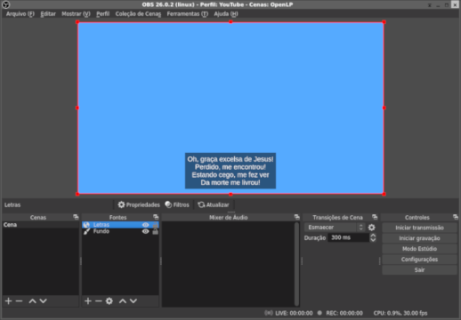

# Letra do OpenLP para o OBS

Camada para mostrar a letra do OpenLP no OBS.

## Instalação

### Configuração do OpenLP

1. Tenha certeza que o plugin `Remoto` esteja habilitado.
2. Abra o diretório de dados do OpenLP: `Ferramentas -> Abrir Pasta de Dados...`.
3. Crie um diretório chamado `stages` se não existir.
4. Copie o diretório `letra` para dentro do diretório `stages`.
5. Vá em `Configurações -> Configurar o OpenLP -> Remoto`, a URL para acessar as letras será a `URL de Visualização de Palco` adicionado `/letra` ao final. Exemplo: `http://192.168.0.1:4316/stage/letra`.

### Configuração do OBS

1. No OBS, vá em `Arquivo -> Configurações -> Vídeo`, e guarde a `Resolução de base (tela)`, após isso pode fechar a janela.
2. Adicione uma fonte `Navegador` na cena desejada, coloque em URL a URL vista no último passo da configuração do OpenLP, e defina a largura e altura conforme a resolução vista no passo 1.
